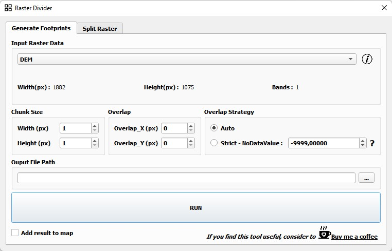
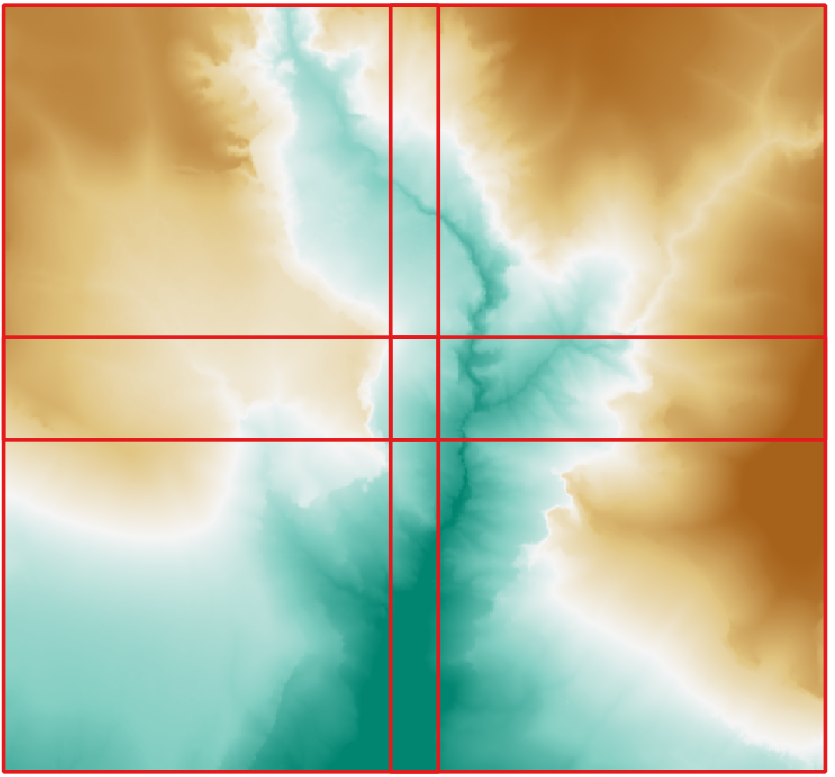
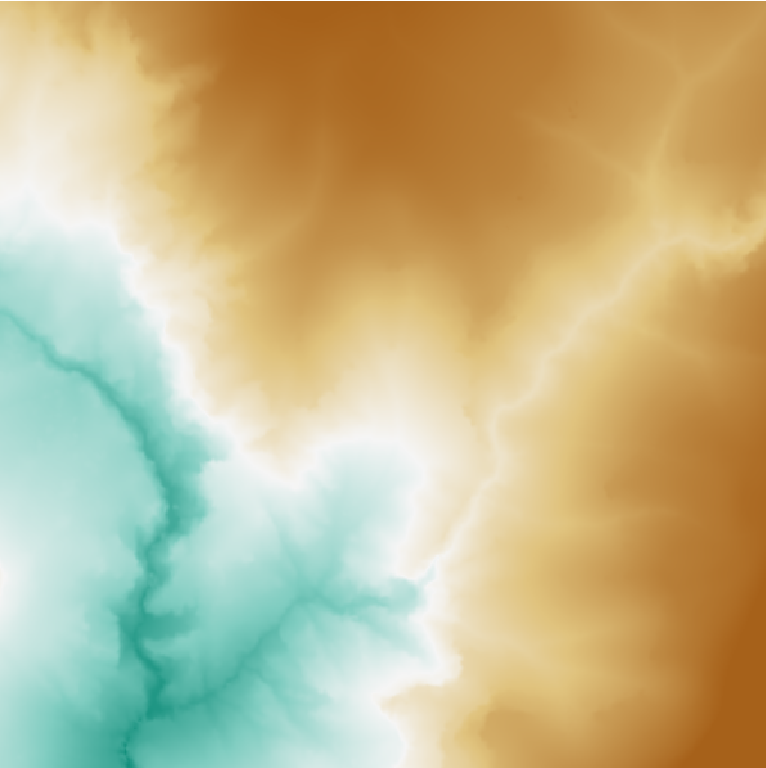
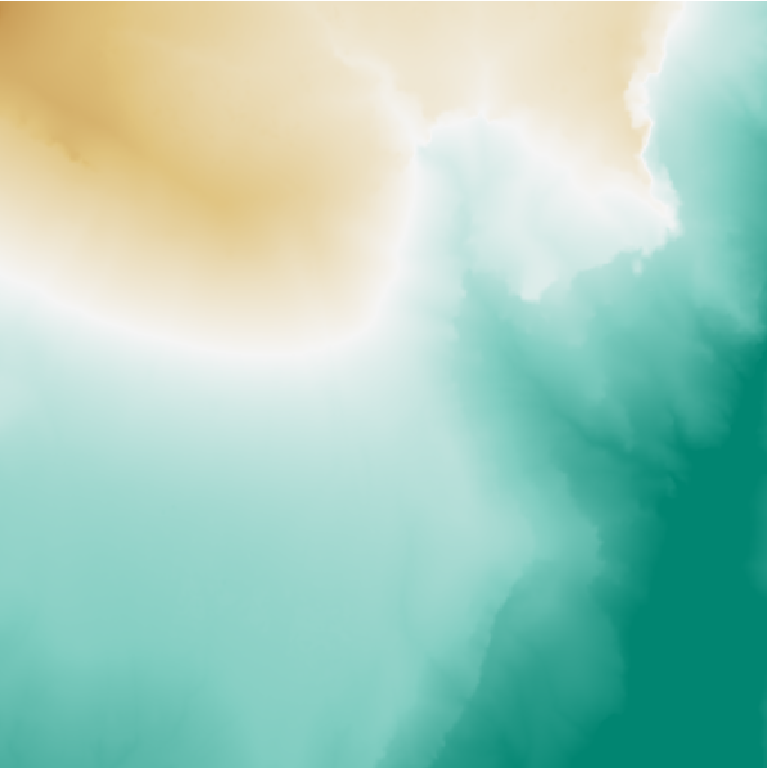
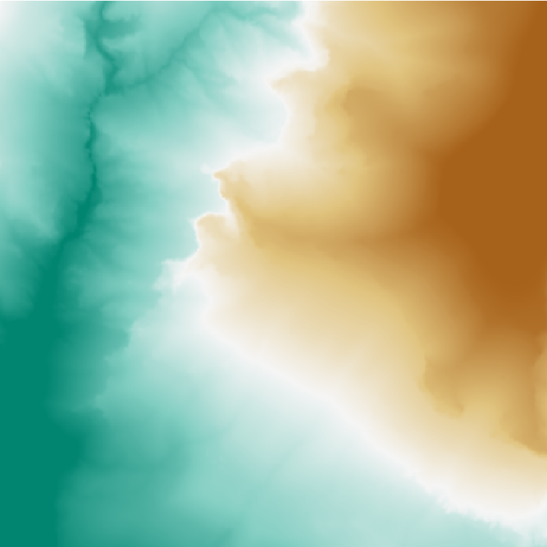
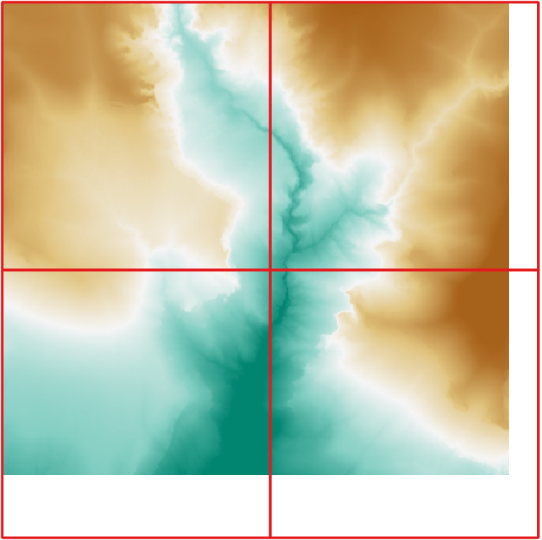
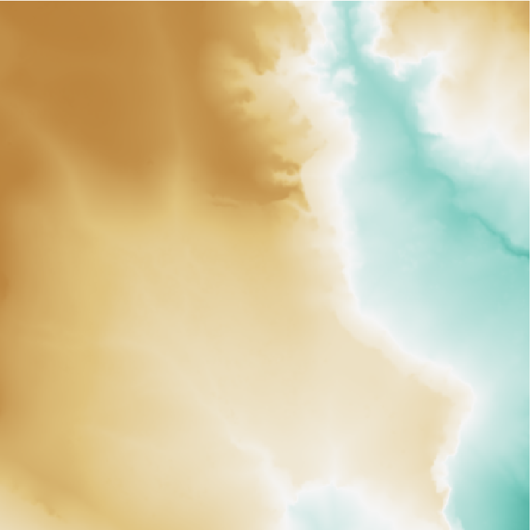
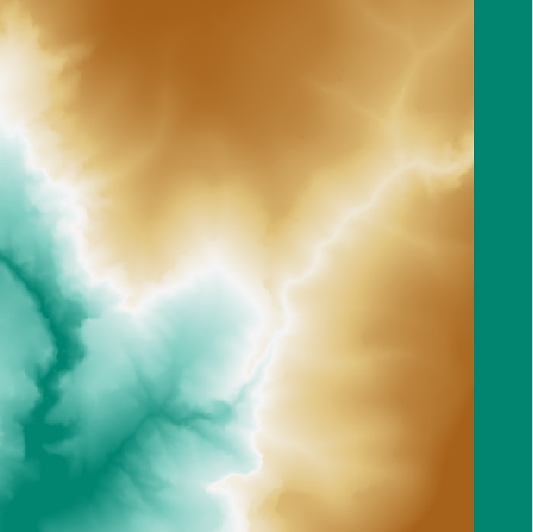
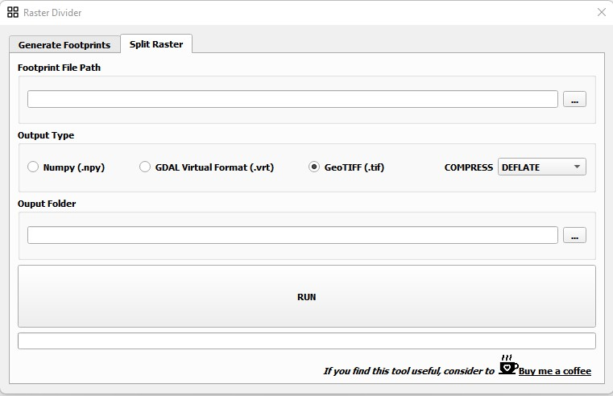

# QGIS Raster Divider Plugin

This plugin allows user to divide raster into equal sized grids depend on desired size.The plugin consists of two section. In first section, footprints of output grids are generated. In second section, raster is splitted based on footprints file. Three types of output formats are available (GeoTiff, VRT, Numpy).
  

### 1-) Generate Footprints

<i>Generate Footprints</i> section is first part of the analysis. In this section a <i><b>Geopackage (GPKG)</b></i> file is created. This file contains informations about the tiles to be generated such as "<i>col_id, row_id, overlap_col, overlap_row, etc.</i>". Tiles that are not desired should be deleted from the attribute table of the GPKG file. The original raster file is splitted based on this file.
 

 
<b>Input  Raster Data:</b> Image to be splitted is specified here.
 

 
<b>Chunk Size:</b> Width, Height sizes of each tile are specified here.
 

 
<b>Overlap:</b> Overlap sizes of each tile are specified here.
 

 
<b>Overlap Strategy:</b> There are two options for overlapping. 
- <b><i>Auto</i></b> : In this method an auto overlapping is applied to tiles to make the subraster completely align with the original raster. For instance; if raster size is 1000 px and desired tile size is 150 px than 6 subraster would be generated with <b>100px residual</b>. In order to prevent this residual, subrasters are overlapped automatically even if the overlapping value is 0. If the overlapping value is set as a number greater than 0, subrasters are overlapped automatically <b>taking this value into account</b>.
  

<table style="border-collapse: collapse; border:1px solid red;" cellpadding="0" cellspacing="0" >
  <tr>
    <td rowspan="2"></td>
    <td></td>    
    <td></td>
  </tr>
  <tr>
    <td></td>
    <td></td>
  </tr>
</table>

  
- <b><i>Strict</i></b> : In this method an auto overlapping is not applied to tiles. In order to make the subraster align with the original raster, padding with a constant value(NoDataValue) is applied to tiles.
  

<table style="border-collapse: collapse; border:1px solid red;" cellpadding="0" cellspacing="0" >
  <tr>
    <td rowspan="2"></td>
    <td></td>    
    <td></td>
  </tr>
  <tr>
    <td></td>
    <td></td>
  </tr>
</table>

 

<b>Output File Path:</b> Output file path is specified here. 

  

### 2-) Split Raster

<i>Split Raster</i> section is second part of the analysis. In this section a <i><b>tiles</b></i> are generated using the GPKG files. Creating all tiles is not mandatory. Tiles that are not desired can be removed from the GPKG file.
 

 
<b>Footprint File Path:</b> GPKG file is specified here.
 

 
<b>Output Type:</b> Output type and COMPRESSION method are specified here.
 
