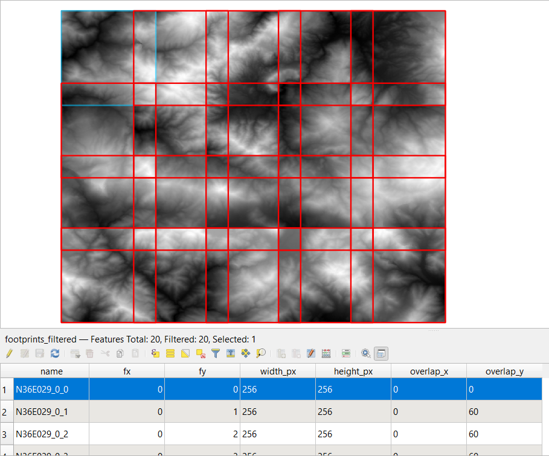

# QGIS Raster Divider Plugin

This plugin allows user to divide raster into equal sized grids depend on desired size.The plugin consists of two section. In first section, footprints of output grids are generated. In second section, raster is splitted based on footprints file. Three types of output formats are available (GeoTiff, VRT, Numpy).
  

### 1-) Generate Footprints

<i>Generate Footprints</i> section is first part of the analysis. In this section a <i><b>Geopackage (GPKG)</b></i> file is created. This file contains informations about the tiles to be generated such as "<i>col_id, row_id, overlap_col, overlap_row, etc.</i>". Tiles that are not desired should be deleted from the attribute table of the GPKG file. The original raster file is splitted based on this file.

  

<b>Input  Raster Data:</b> Image to be splitted is specified here.

 
<b>Chunk Size:</b> Width, Height sizes of each tile are specified here.
 

 
<b>Overlap:</b> Overlap sizes of each tile are specified here.
 

 
<b>Overlap Strategy:</b> There are two options for overlapping. 
- **Auto** : 
- **_Strict_** : 

  
  
  

    
  

<table style="border-collapse: collapse; border:1px solid red;" cellpadding="0" cellspacing="0" >
  <tr>
    <td rowspan="2"></td>
    <td></td>    
    <td></td>
  </tr>
  <tr>
    <td></td>
    <td></td>
  </tr>
</table>

 

<table style="border-collapse: collapse; border:1px solid red;" cellpadding="0" cellspacing="0" >
  <tr>
    <td rowspan="2"></td>
    <td></td>    
    <td></td>
  </tr>
  <tr>
    <td></td>
    <td></td>
  </tr>
</table>

<table style="border-collapse: collapse; border:1px solid red;" cellpadding="0" cellspacing="0" >
  <tr>
    <td></td>
  </tr>  
</table>
