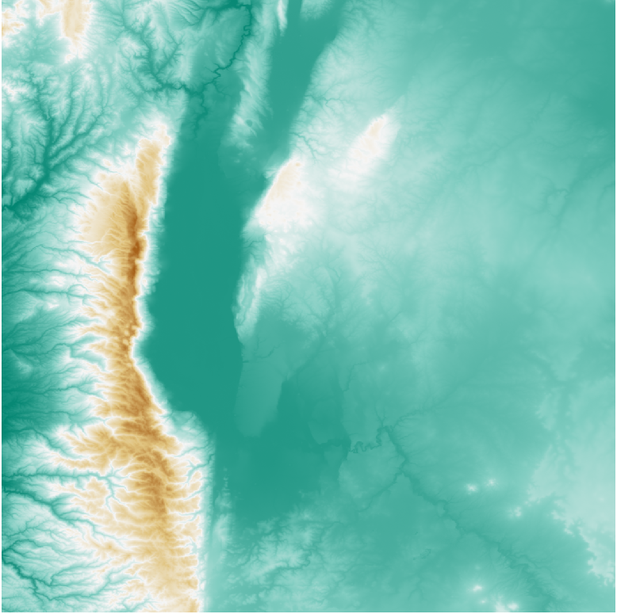

# QGIS Easy Raster Splitter Plugin

With this plugin, it is possible to split raster files into equally sized chunks.
 

  

 

<table style="border-collapse: collapse; border:1px solid red;">
  <tr>
    <td rowspan="2"></td>
    <td></td>    
    <td></td>
  </tr>
  <tr>
    <td></td>
    <td></td>
  </tr>  
  
</table>
